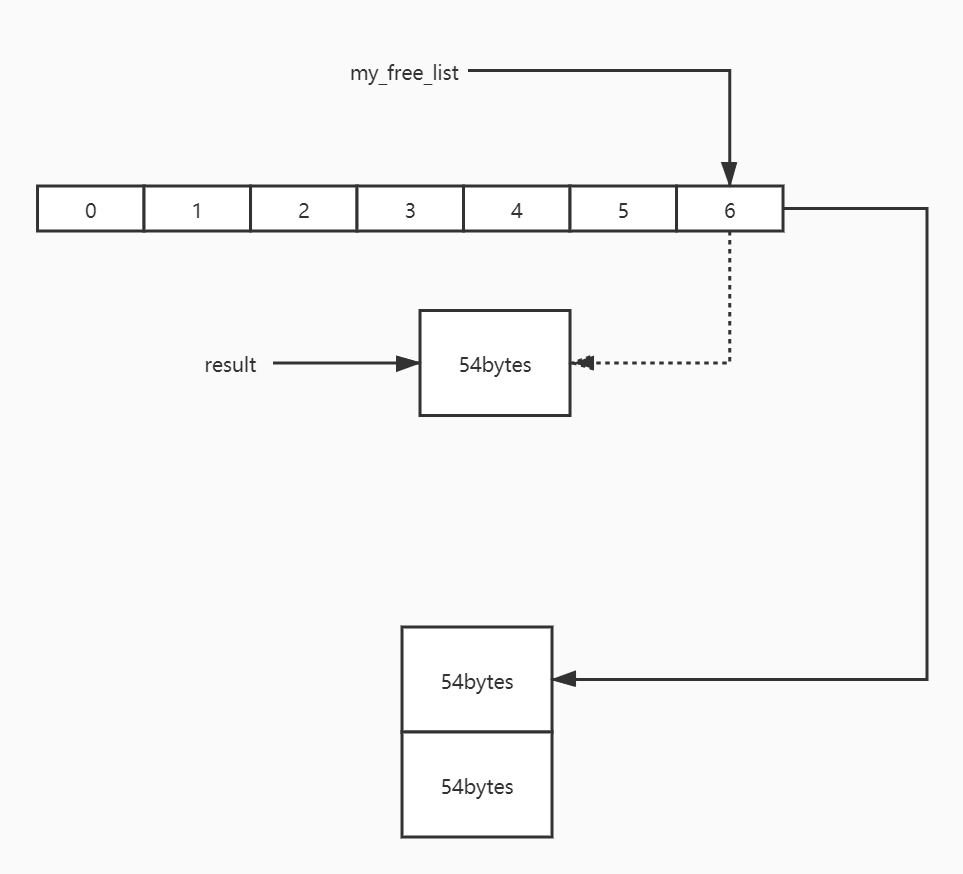

# 空间配置器 allocator

## SGI空间适配器 std::alloc

我们所习惯的 `C++` 内存配置和释放操作如下

```C++
class Foo { ... };
Foo *pf = new Foo;  // 配置内存 构造对象
delete pf;  // 析构对象 释放内存
```

其中new包含两个阶段

* 调用 `::operator new` 配置内存
* 调用 `Foo::Foo()` 即默认构造函数构造对象内容

delete包含类似两个阶段

* 调用 `Foo:~Foo()` 将对象析构
* 调用 `::operator delete` 释放内存

STL allocator将两个阶段的操作区分

* 内存配置: `alloc::allocate()`
* 内存释放: `alloc::deallocate()`
* 对象构造: `::construct()`
* 对象析构: `::destroy()`

## 对象构造

```cpp
template <class T1, class T2>
inline void construct(T1* p, const T2& value) {
    new (p) T1(value);  // placement new 在已经分配好内存的位置构建对象
}
```

`construct()` 接受一个指针 `p` 和一个初值 `value` , 将初值设定到指针所指空间

## 对象析构

```C++
// first version
template <class T>
inline void destroy(T* pointer) {
    pointer->~T();
}
```

这是 `destroy()` 的第一个版本, 接受一个指针, 直接调用该对象的析构函数.

```cpp
// second version
// 接受两个迭代器, 找出元素数值型别, 利用 __type_traits<> 调用不同函数
template <class ForwardIterator>
inline void destroy(ForwardIterator first, ForwardIterator last) {
    __destroy(first, last, value_type(first));  // value type 实现原理见下章
}

// 判断 value_type 是否有 trivial destructor 即无析构函数
template <class ForwardIterator, class T>
inline void __destroy(ForwardIterator first, ForwardIterator last, T*) {
    typedef typename __type_traits<T>::has_trivial_destructor trivial_destructor;  // 具体原理见下章
    __destroy_aux(first, last, trivial_destructor());  // 创建一个临时对象
}

// non-trivial destructor
template <class ForwardIterator>
inline void __destroy_aux(ForwardIterator first, ForwardIterator last, __false_type) {
    for( ; first < last; ++first) {  // 前闭后开区间
        destroy(&*first);  // 调用 first version 参数为迭代器所指对象的地址 用到了迭代器的操作符重载
    }
}

// trivial destructor
template <class ForwardIterator>
inline void __destroy_aux(ForwardIterator first, ForwardIterator last, __true_type) {}  // do nothing 无需析构

// second version 针对迭代器为 char* 和 wchar_t* 的特化版
inline void destroy(char*, char*) {}  // do nothing
inline void destroy(wchar_t*, wchar_t*) {} // do nothing

```

第二版本, 接受 `first` 和 `last` 两个迭代器, 将 `[first, last)` 范围内所有对象析构. 利用 `value_type()` 得到迭代器所指对象的类型, 然后利用 `_type_traits<T>` 判断该类别析构函数是否无关痛痒, 是则不做任何事, 否则遍历整个范围一次调用第一个版本的 `destroy()`  
`value_type()` 和 `__type_traits_()` 具体实现见下章.

## 内存配置与释放

SGI有双层级配置器

* 第一级使用 `malloc()` 和 `free()`
* 第二级使用不同策略, 区块大于 `128bytes` 时, 调用第一级, 小于 `128bytes` 时, 使用 `memory pool`  

若 `__USE_MALLOC` 被定义, 开放第一级, 否则开放第二级.

```cpp
# ifdef __USE_MALLOC

    typedef __malloc_alloc_template<0> malloc_alloc;
    typedef malloc_alloc alloc; // 第一级

# else
    typedef __default_alloc_template<__NODE_ALLOCATOR_THREADS, 0> alloc;  // 第二级
# endif /* ! __USE_MALLOC */
```

`alloc` 不接受 `template` 参数, `SGI` 会为配置器包装一个接口来符合 `STL` 规格:

```cpp
template <class T, class Alloc>
class simple_alloc {
    public:
    // 简单的转调用
    static T* allocate(size_t n) {
        return 0 == n ? 0 : (T*) Alloc::allocate(n * sizeof(T));
    }

    static T* allocate(void) {
        return (T*) Alloc::allocate(sizeof(T));
    }

    static void deallocate(T* p, size_t n) {
        if (0 != n) {
            Alloc::deallocate(p, n * sizeof(T));
        }
    }

    static void deallocate(T *p) {
        Alloc::deallocate(p, sizeof(T));
    }
};
```

`SGI` 容器全部使用这个 `simple_alloc` 接口:

```cpp
// 实际运用方式
template <class T, class Alloc = alloc>  // 缺省使用 alloc
class vector {
    typedef simple_alloc<T, Alloc> data_allocator;

    void deallocate() {
        if (...) {
            data_allocator::deallocate(start, end_of_storage - start);
        }
    }
    ...
};
```

## 第一级配置器 `__malloc_alloc_template`

```cpp
// > 128 bytes
template <int inst>
class __malloc_alloc_template {
    private:
    // out of memory
    static void* oom_malloc(size_t);
    static void* oom_realloc(void*, size_t);
    static void (*__malloc_alloc_oom_handler) ();  // 函数指针

    public:
    // 分配 n bytes
    static void* allocate(size_t n) {
        void* result = malloc(n);  // 直接malloc
        // out of memory
        if (0 == result) {
            result = oom_malloc(n);
        }
        return result;
    }

    // 回收 p
    static void deallocate(void* p, size_t /* n */) {
        free(p);
    }

    // 再分配 p new_sz bytes
    static void* reallocate(void* p, size_t /* old_sz */, size_t new_sz) {
        void* result = realloc(p, new_sz);  // 直接 realloc
        // out of memory
        if (0 == result) {
            result = oom_realloc(p, new_sz);
        }
        return result;
    }

    // 指定 out of memory handler
    static void (*set_malloc_handler(void (*f)()) ) () {  // 参数和返回值都是函数指针
        void (*old)() = __malloc_alloc_oom_handler;
        __malloc_alloc_oom_handler = f;  // 更新
        return (old);  // 返回之前的 out of memory handler
    }
};

// 初始设为空指针
template <int inst>
void (* __malloc_alloc_template<inst>::__malloc_alloc_oom_handler) () = 0;

// out of memory malloc
template <int inst>
void* __malloc_alloc_template<inst>::oom_malloc(size_t n) {
    void (*my_malloc_handler) ();
    void *result;

    for (;;) {  // 一直尝试 释放 配置...
        my_malloc_handler = __malloc_alloc_oom_handle;
        if (0 == my_malloc_handler) {
            __THROW_BAD_ALLOC;  // 未指定处理例程 直接抛异常
        }
        (*my_malloc_handler)();  // out of memory 处理例程
        result = malloc(n);  // 配置内存
        if (result) {
            return result;
        }
    }
}

// out of memory realloc
template <int inst>
void* __malloc_alloc_template<inst>::oom_realloc(void* p, size_t n) {
    void (*my_alloc_handler) ();
    void *result;

    for (;;) {  // 一直尝试 释放 配置...
        my_malloc_handler = __malloc_alloc_oom_handle;
        if (0 == my_malloc_handler) {
            __THROW_BAD_ALLOC;  // 未指定处理例程 直接抛异常
        }
        (*my_malloc_handler)();  // out of memory 处理例程
        result = realloc(p, n);  // 配置内存
        if (result) {
            return result;
        }
    }
}

// inst 指定为 0
typedef __malloc_alloc_template<0> malloc_alloc;
```

`__malloc_alloc_oom_handler` 是内存不足处理例程, 设定此函数是客端责任.

## 第二级配置器 `__default_alloc_template`

为了避免小额区块造成的内存碎片和配置时的额外负担, 采取以下策略

* 区块大于 `128 bytes` , 转给第一级配置器处理
* 小于 `128 bytes` , 使用 `memory pool`

第二级配置器会将任何小于 `128 bytes` 的内存需求上调到 `8` 的倍数, 例如 `30 bytes->32 bytes`, 维护 `16` 个 `free-lists` , 分别管理 `8 bytes 16 bytes ...128 bytes` 的区块.

```cpp
// free-lists
union obj {
    union obj* free_list_link;
    char client_data[1];  // for client 唯一的作用是避免指针的强制转换
}
```

可以这样来理解: `obj->client_data` 可以视为当前区块的指针, 类型为 `char*` ,  `obj->free_list_link` 存储的内容是下个 `obj` 的地址, 构成链表, 如下图.


第二级配置器的部分实现:

```cpp
enum {__ALIGN = 8};  // bytes 上调间距
enum {__MAX_BTYES = 128};  // 区块上限
enum {__NFREELISTS = __MAX_BYTES / __ALIGN};  // free-lists 个数

// 第二级配置器
// 第一参数用于多线程环境 暂不讨论
template <bool threads, int inst>
class __default_alloc_template {
    private:
    // bytes上调至 8 的倍数
    static size_t ROUND_UP(size_t bytes) {
        return (((bytes) + _ALIGN - 1) & ~(__ALIGN - 1))  // + 7 低三位置0
    }

    private:
    // free-lists
    union obj {
        union obj* free_list_link;
        char client_data[1];
    };

    private:
    // free-list 大小为 16
    static obj* volatile free_list[_NFREELISTS];
    // 根据区块大小求 free-list 索引
    static size_t FREELIST_INDEX(size_t bytes) {
        return (((bytes) + _ALIGN - 1)/_ALIGN - 1); // (( n + 7 ) / 8 ) - 1
    }

    // free-list为空时调用
    static void* refill(size_t n);
    static char* chunk_alloc(size_t size, int& nobjs);

    // memory pool 起始位置
    static char* start_free;
    static char* end_free;
    static size_t heap_size;

    public:

    static void* allocate(size_t n);
    static void* deallocate(void* p, size_t n);
    static void* reallocate(void* p, size_t old_sz, size_t new_sz);
};

// 定义与初值设定 start_free
template <bool threads, int inst>
char* __default_alloc_template<threads, inst>::start_free = 0;

// 定义与初值设定 end_free
template <bool threads, int inst>
char* __default_alloc_template<threads, inst>::end_free = 0;

// 定义与初值设定 heap_size
template <bool threads, int inst>
size_t __default_alloc_template<threads, inst>::heap_size = 0;

// 定义与初值设定 free_list
template <bool threads, int inst>
__default_alloc_template<threads, inst>::obj* volatile __default_alloc_template<threads, inst>::free_list[__NFREELISTS] = {0, 0, 0, 0, 0, 0, 0, 0, 0, 0, 0, 0, 0, 0, 0, 0, };

```

### 空间配置 `allocate()`

```cpp
static void* allocate(size_t n) {
    obj* voalite* my_free_list;
    obj* result;

    // 大于  128bytes 使用第一级配置器
    if (n > (size_t) __MAX_BYTES) {
        return (malloc_alloc::allocate(n));
    }

    // 寻找 free-list 指定元素位置的指针
    my_free_list = free_list + FREELIST_INDEX(n);  // 指针运算
    result = *my_free_list;  // free-list 对应元素 类型为 obj*
    if (result == 0) {
        // 对应位置为空则填充
        void* r = refill(ROUND_UP(n));  // n上调之后再调用
        return r;
    }

    // 删除 free-list 对应位置头节点
    *my_free_list = result->free_list_link;  // 指向下一个区块 维护 free-list
    return result;  // 选中区块的指针
};
```

可以通过下图理解:



#### 空间释放 `deallocate()`

```cpp
static void deallocate(void* p, size_t n) {
    obj* q = (obj*) p;
    obj* volatile* my_free_list;

    // 大于 128 bytes 使用第一级配置器
    if (n > (size_t) __MAX_BYTES) {
        malloc_alloc::deallocate(p, n);
        return;
    }

    //可以认为此时 n 为 8 的倍数
    // 寻找 free-list 指定元素
    my_free_list = free_list + FREELIST_INDEX(n);

    // 链表的头节点插入操作
    q->free_list_link = *my_free_list;
    *my_free_list = q;
}
```

原理与空间配置类似.

### 重新填充 `refill()`

当空间配置 `allocate()` 发现 `free_list` 已经空了就使用 `refill()` , 新的内存来自 `chunk_alloc()` , 默认获得 `20` 个区块, 内存空间不足可能会小于 `20` , 看代码:

```cpp
template <bool threads, int inst>
void* __default_alloc_template<threads, inst>::refill(size_t n) {
    int nobjs = 20;

    // 尝试获得 nobjs 个区块
    // nobjs 引用传递 可能会更改到小于 20
    char* chunk = chunk_alloc(n, nobjs);
    obj* volatile* my_free_list;
    obj* result;
    obj* current_obj;
    obj* next_obj;
    int i;

    // 如果 chunk_alloc() 更改 nobjs 为 1 , 直接返回
    if (1 == nobjs) {
        return chunk;
    }

    // 将 chunk 串成链表
    my_free_list = free_list + FREELIST_INDEX(n);  // free_list 指定索引
    result = (obj*) chunk;  // chunk 起始位置用来返回
    *my_free_list = next_obj = (obj*) (chunk + n);  // 链表之间内存间隔为 n

    for (i = 1; ; i++) {
        currnet_obj = next_obj;
        next_obj = (obj*) ((char*)next_obj + n);
        if (nobjs - 1 == i) {  // 最后一个
            current_obj->free_list_link = 0;
            break;
        }
        else {
            current_obj->free_list_link = next_obj;
        }
    }
    return result;
}
```

#### 内存池 `memory pool`

```cpp
// 用于给 free_list 提供内存
// size 为 8 的倍数
template <bool threads, int inst>
char* __default_alloc_template<threads, inst>::chunk_alloc(size_t size, int& nobjs) {  // 这里 nobjs 为引用传递 可能会更改
    char* result;
    size_t total_bytes = size * nobjs;
    size_t bytes_left = end_free - start_free;  // 内存池剩余空间

    if (bytes_left >= total_bytes) {  // 够用
        result = start_free;
        start_free += total_bytes;
        return result;
    }
    else if (bytes_left >= size) {  // 不够 但是够一个以上区块
        nobjs = bytes_left / size;  // 更改 nobjs 为当前已有空间的最大分配个数
        total_bytes = size * nobjs;
        result = start_free;
        start_free += total_bytes;  // 更新 memory pool 起始位置
        return result;
    }
    else {  // 当前 memory pool 一个区块也无法提供
        size_t bytes_to_get = 2 * total_bytes + ROUND_UP(heap_size >> 4);  // 内存池增加的量 (2 * x + z), x 为当前需要的字节数, z 为当前 heap_size 大小除以 16 上调至 8 的倍数 例如 32 -> 2 -> 8

        // 尝试将剩余内存加入 free_list 争取索引最大
        // 例如 size = 24, memory_left = 23, 此时会把这 23 个字节加入到 free_list[1]
        if (bytes_left > 0) {  // memory pool 还有内存 移入 free-list
            obj* volatile* my_free_list = free_list + FREELIST_INDEX(bytes_left);  // 得到合适索引
            ((obj*)start_free) -> free_list_link = *my_free_list;  // 头插法插入
            *my_free_list = (obj*) start_free;  // 更新头节点
        }
        start_free = (char *) malloc(bytes_to_get);  // bytes_to_get 可以保证为 8 的倍数

        if (0 == start_free) {  // malloc 失败
            int i;
            obj* volatile* my_free_list, *p;
            // 望 free_list 大的方向找
            for (i = size; i <= __MAX_BYTES; i += __ALIGN) {
                my_free_list = free_list + FREELIST_INDEX(i);
                p = *my_free_list;
                if (0 != p){  // free_list 大的方向有
                    *my_free_list = p -> free_list_link;  // 释放一个区块
                    start_free = (char*) p;
                    end_free = start_free + i;
                    return (chunk_alloc(size, nobjs));  // 修正 nobjs
                }
            }
            end_free = 0;
            start_free = (char*)malloc_alloc::allocate(bytes_to_get);  // 第一级配置器
        }
        heap_size += bytes_to_get;  // heap_size 是一个随着此函数的调用 越来越大的一个数 用于动态调整
        end_free = start_free + bytes_to_get;
        // 上述操作只是得到了想要得到的内存空间, 并未更新实际分配的 nobjs
        // 修正 nobjs  需要深刻理解这里递归调用的意义
        return (chunk_alloc(size, nobjs));
    }
}
```

## 内存基本处理工具

`STL` 定义了五个作用于未初始化空间的全局函数

* `construct()`
* `destroy()`
* `uninitialized_copy()`
* `uninitialized_fill()`
* `uninitialized_fill_n()`

前两个已经介绍了 这里描述后三个

```cpp
// uninitialized_copy
template <class InputIterator, class ForwardIterator>
ForwardIterator uninitialized_copy(InputIterator first, InputIterator last, ForwardIterator result);
```

将 `[result, result+(last-first))` 范围内所指的对象分别初始化为 `[first, last)` 范围内迭代器所指的对象.

```cpp
// uninitialized_fill
template <class ForwardIterator, class T>
void uninitialized_fill(ForwardIterator first, ForwardIterator last, const T& x);
```

将 `[first, last)` 范围内所指的对象分别初始化为 `x` .

```cpp
// uninitialized_fill_n
template <class ForwardIterator, class Size, class T>
void uninitialized_fill(ForwardIterator first, Size n, const T& x);
```

将 `[first, first+n)` 范围内所指的对象分别初始化为 `x` .

具体实现见下章.
